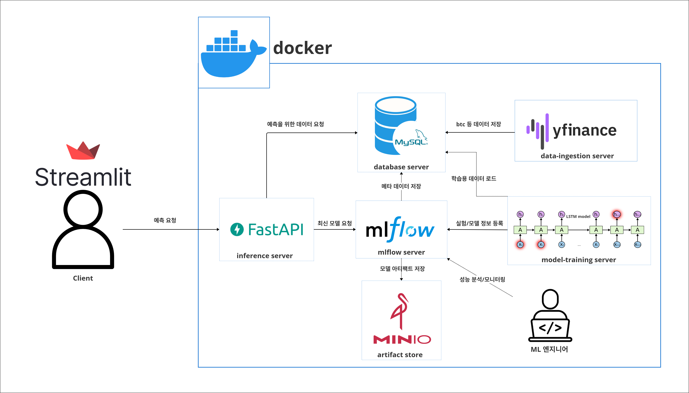
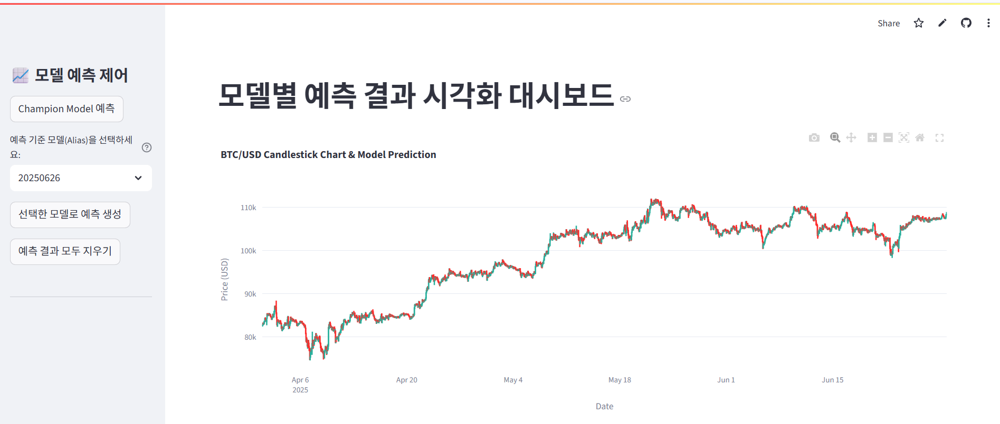

# 🚀 MLOps와 Docker를 활용한 비트코인 가격 예측 자동화 파이프라인

## 1. 한줄 소개

**📈프로젝트명:** MLOps와 Docker를 활용한 비트코인 가격 예측 자동화 파이프라인

**⚙️소개:** Docker 기반 마이크로서비스 아키텍처와 MLflow를 활용해 비트코인 가격 예측 모델의 학습부터 배포까지 전 과정을 자동화합니다.

## 2. 세미나 목적

**💡핵심 목표:** MLOps에 대한 근본적인 의문점(MLOps를 알아야 하는가, 무엇인가, 필요한가)을 해소하고, 참가자들이 MLOps 개념을 명확히 이해하며 면접 등에서 자신 있게 설명할 수 있도록 돕습니다. 특히, AI 모델을 POC 단계에서 실서비스로 발전시키기 위한 MLOps의 중요성과 금융권에서의 MLOps 도입 필요성을 강조합니다.
<br>

**사용 기술**

  
  

## 3. 🧑‍💻 구성원 (Contributor)

| 이름 | 담당 기능 |
|---|---|
| **강인혁** | 발표, 추론 서버 구현 |
| **이정환** | 모델 선정 및 학습, 서버 배포 |
| **김현우** | 도커 환경 설정, 시각화 서버 및 추론 API 구현 |
| **신동호** | 데이터베이스 서버, 발표 자료 |

## 4. 👥 대상 청중 (Audience)

🎓 Woori FISa AI 엔지니어링 수강생들

🚀 AI/ML 개발자, 데이터 사이언티스트, 백엔드 개발자, MLOps에 관심 있는 학생 등

## 5. 🎯 세미나 학습 목표 (Learning Objectives)

1. **🧠 MLOps 핵심 개념 및 특징:** DevOps와의 관계, MLOps의 정의, 필요성, 그리고 Google Cloud의 MLOps 레벨(0, 1, 2단계)을 이해합니다.

2. **🐳 Docker의 개념 및 MLOps에서의 이점:** Docker의 기본 개념(이미지, 컨테이너, 도커파일, 도커 컴포즈)을 이해하고, MLOps 환경에서 Docker가 왜 필수적인지 학습합니다.

3. **🏦 MLOps 활용 사례:** 금융권에서의 MLOps 도입 필요성과 카카오페이, NatWest 등 실제 기업의 MLOps 적용 사례를 통해 MLOps의 효과를 파악합니다.

4. **🛠️ MLOps 구현 과정 공유:** 비트코인 종가 예측 모델을 통해 데이터 드리프트에 따른 자동 재학습 및 서빙 모델 교체 자동화를 구현하는 과정을 학습하고, MLOps의 실질적인 효과를 체험합니다.

5. **📊 MLflow 활용:** 실험 추적, 모델 버전 관리, 서빙 과정의 실제 적용

6. **🔄 자동 재학습 및 배포 워크플로우:** 특정 주기마다 모델 자동 업데이트

## 6. 🏗️ 아키텍처 및 워크플로우

이 프로젝트는 비트코인 가격 예측 모델의 학습, 배포, 추론 과정을 자동화하는 MLOps 파이프라인을 시뮬레이션합니다. 전체 시스템은 Docker Compose를 통해 마이크로서비스 형태로 구성됩니다.

### 1) 🗺️ 아키텍처 개요



### 2) 🧩 주요 구성 요소 및 역할 

1. **🗄️mlflow-backend-store (MySQL):** MLflow의 메타데이터(실험 기록, 모델 정보 등)를 저장하는 데이터베이스입니다.

2. **📦mlflow-artifact-store (MinIO):** 학습된 모델 파일, 스케일러 등 MLflow 아티팩트를 저장하는 오브젝트 스토리지입니다.

3. **🌐mlflow-server:** MLflow UI를 제공하고, 실험 추적 및 모델 레지스트리 기능을 담당하는 핵심 서버입니다. 

4. **📥etl-job (mlops-db-ingestion):** Binance, Yahoo Finance 등에서 비트코인, 금, VIX, 나스닥 데이터를 수집하고 전처리하여 `mlflow-backend-store`에 적재하는 ETL(Extract, Transform, Load) 작업을 수행합니다.

5. **🧠training-client (mlflow-client):** `etl-job`을 통해 적재된 데이터를 기반으로 비트코인 가격 예측 모델(LSTM)을 학습하고, 학습된 모델과 관련 메타데이터를 MLflow에 기록 및 등록합니다. 주기적으로 최신 데이터를 학습하여 모델을 업데이트합니다.

6. **⚡inference-server (mlops_inference_server):** FastAPI 기반의 추론 서버로, 클라이언트의 예측 요청을 받아 MLflow에 등록된 최신 모델을 로드하여 예측을 수행합니다. 주기적으로 MLflow를 확인하여 최신 모델로 자동 업데이트됩니다.

7. **📊visualizer-server:** Streamlit 기반의 웹 대시보드로, 실제 비트코인 가격 데이터와 모델의 예측 결과를 시각화하여 보여줍니다. 사용자는 다양한 모델의 예측 성능을 비교할 수 있습니다.

각 서버에 대한 더 자세한 정보는 [`role_of_each_server.md`](./role_of_each_server.md) 참고

### 3) 🎬 워크플로우 시나리오

이 시뮬레이션은 AI 모델이 **주기적으로 최신 데이터를 학습하고, 그 결과를 자동으로 서비스에 반영**하는 완전 자동화 시스템을 보여줍니다.

1.  **데이터 수집 및 적재:** 
`etl-job`이 주기적으로 최신 데이터를 수집하여 `mlflow-backend-store`에 저장합니다.
2.  **모델 학습:** 
`training-client`는 `mlflow-backend-store`의 최신 데이터를 사용하여 새로운 예측 모델을 학습합니다. 
학습된 모델은 `mlflow-artifact-store`에 저장되고, 모델의 메타데이터(버전, 성능 등)는 `mlflow-backend-store`에 기록됩니다. 
모델은 날짜 기반의 별칭(Alias)으로 MLflow 모델 레지스트리에 등록됩니다. 훈련된 모델은 `mlflow-artifact-store`에 저장되고, 모델의 메타데이터(버전, 성능 등)는 `mlflow-backend-store`에 기록됩니다.
3.  **모델 배포 및 추론:** 
`inference-server`는 주기적으로 MLflow 모델 레지스트리를 확인하여 가장 최신 버전의 모델을 자동으로 로드하고 서비스에 반영합니다. 
클라이언트(visualizer-server)로부터 예측 요청을 받으면, 현재 서비스 중인 최신 모델을 사용하여 예측 결과를 제공합니다.
4.  **시각화 및 모니터링:** 
`visualizer-server`는 `inference-server`로부터 예측 결과를 받아 실제 데이터와 함께 시각화하여 모델의 성능 변화를 직관적으로 확인할 수 있도록 합니다.

## 8. 🚀 Quick Start

### 🧭 시각화 서버 접속

streamlit 시각화 서버 ([click](https://visualize-server.streamlit.app/))


### 로컬 실행 방법: 💻

1.  **레포지토리 클론:** ⬇️
    ```bash
    git clone https://github.com/Fisa05-Docker-MLOps/tech-semina.git
    cd tech-semina
    ```
2.  **.env 파일 생성 및 환경변수 설정:** ⚙️
    `.env.sample` 파일을 복사하여 `.env` 파일을 생성하고, 필요한 환경변수(예: `MYSQL_ROOT_PASSWORD`, `MINIO_ROOT_USER`, `MINIO_ROOT_PASSWORD` 등)를 설정합니다. 각 서비스 디렉토리 내의 `.env.sample` 파일도 참고하세요.
3.  **Docker Compose로 서비스 실행** ▶️
    ```bash
    docker compose up -d --build
    ```
    (모든 서비스가 빌드되고 백그라운드에서 실행됩니다.)
4.  **컨테이너 상태 확인** ✅
    ```bash
    docker compose ps
    ```
5.  **가상환경 설정 및 시각화 앱 실행**
    ```bash
    # 가상환경 생성
    cd visualizer-server
    python -m venv .venv

    # 가상환경 실행
    # Linux/macOS 의 경우
    source .venv/bin/activate

    # Windows 의 경우
    .venv\Scripts\activate 

    # 라이브러리 설치
    pip install -r requirements.txt

    # 스트림릿 앱 실행
    streamlit run btc_candlestick_app.py
    ```

5.  **엔드포인트 테스트 및 시각화 대시보드 접속:** 🔗
    *   MLflow UI📊
         `http://localhost:5000`
    *   FastAPI Inference Server⚡
        ```bash
        curl http://localhost:8000/health
        ```
        또는 `http://localhost:8000/docs` 접속
    *   Streamlit Visualizer📈
        `http://localhost:8501`

## 9. 💡향후 확장 및 참고 자료

**🚀 확장 아이디어**

*   모니터링 및 알림 연동 (예: Prometheus, Grafana, Slack 알림)
*   다른 모델(예: Transformer, Prophet) 실험 및 비교
*   CI/CD 파이프라인 (예: GitHub Actions, Jenkins) 적용을 통한 자동화 강화
*   Feature Store 고도화
*   A/B 테스트 및 모델 롤백 기능 구현 

**📄 참고 문헌 및 MLOps 개념 자료**

*   MLflow 공식 문서
    1. [MLflow 공식문서](https://mlflow.org/docs/2.2.2/)
*   MLOps 관련 연구 아티클 및 서적
    1. [(MLOps): Overview, Definition, and Architecture](https://arxiv.org/abs/2205.02302)
    2. [MLOps for ML Engineers](https://mlops-for-mle.github.io/tutorial/docs/intro)
*   카카오뱅크, 카카오페이 등 실제 기업의 MLOps 적용 사례
    1. [카카오뱅크 mlops 적용기](https://www.youtube.com/watch?v=Fj0MOkzCECA)
    2. [카카오페이 mlops 적용기](https://www.youtube.com/watch?v=5FvTXzDLPxI&t=1442s)
*   Docker 및 Kubernetes 관련 자료
    1. [토크아이티(Talk IT)](https://www.youtube.com/watch?v=cjrUtRzJJqY)
---