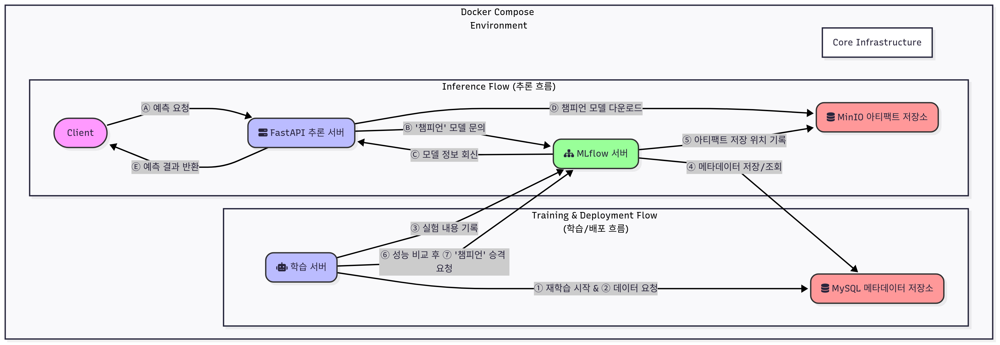

# 다이어그램 분석

# MLOps 워크플로우 다이어그램 분석

이 문서는 제공된 `MLOps_workflow.png` 이미지를 기반으로 MLOps 파이프라인의 전체 워크플로우를 분석한 내용입니다. 이 다이어그램은 **Docker Compose** 환경 내에서 AI 모델의 학습, 배포, 추론이 어떻게 유기적으로 연결되는지 보여줍니다.

MLOps Workflow Diagram

---

## 🎛️ 시스템 구성 요소

다이어그램에 나타난 주요 구성 요소들은 다음과 같습니다.

- **Client (클라이언트):** 최종 사용자 또는 시각화 대시보드 애플리케이션을 의미합니다. 예측을 요청하고 결과를 받습니다.
- **FastAPI 추론 서버:** 클라이언트의 예측 요청을 받아 AI 모델을 통해 예측을 수행하고 결과를 반환하는 API 서버입니다.
- **MLflow 서버:** AI 모델의 학습 과정(실험)을 추적하고, 모델의 버전 및 상태(Production, Staging 등)를 관리하는 중앙 관제 시스템입니다.
- **MinIO 아티팩트 저장소:** 학습된 모델 파일, 데이터셋 등 크기가 큰 아티팩트(결과물)를 저장하는 오브젝트 스토리지입니다.
- **학습 서버:** 새로운 데이터를 기반으로 AI 모델을 학습시키고, 모델의 성능을 평가하며, 필요시 모델을 업데이트하는 역할을 수행합니다.
- **MySQL 메타데이터 저장소:** MLflow의 백엔드 데이터베이스로 사용되어, 실험 메타데이터(파라미터, 메트릭 등)와 모델의 위치 정보를 저장합니다.
- **Docker Compose Environment:** 이 모든 구성 요소들이 컨테이너화되어 하나의 통합된 환경에서 실행되고 통신할 수 있도록 관리하는 기반 기술입니다.

---

## 🔄 워크플로우 흐름 분석

다이어그램은 크게 두 가지 주요 흐름으로 나뉩니다.

### 1. Inference Flow (추론 흐름)

이 흐름은 클라이언트가 AI 모델의 예측을 요청하고 결과를 받는 과정을 나타냅니다.

- **Ⓐ 예측 요청:** `Client`가 `FastAPI 추론 서버`에 예측을 요청합니다.
- **Ⓑ ‘챔피언’ 모델 문의:** `FastAPI 추론 서버`는 `MLflow 서버`에 현재 서비스 중인 ‘챔피언’ 모델(Production 모델)이 무엇인지 문의합니다.
- **Ⓒ 모델 정보 회신:** `MLflow 서버`는 `MySQL 메타데이터 저장소`에 저장된 정보를 조회하여, 현재 챔피언 모델의 버전과 `MinIO 아티팩트 저장소` 내의 위치를 `FastAPI 추론 서버`에 알려줍니다.
- **Ⓓ 챔피언 모델 다운로드:** `FastAPI 추론 서버`는 `MLflow 서버`로부터 받은 위치 정보를 바탕으로 `MinIO 아티팩트 저장소`에서 실제 챔피언 모델 파일을 다운로드합니다.
- **Ⓔ 예측 결과 반환:** `FastAPI 추론 서버`는 다운로드한 챔피언 모델을 사용하여 예측을 수행하고, 그 결과를 `Client`에게 반환합니다.

### 2. Training & Deployment Flow (학습/배포 흐름)

이 흐름은 AI 모델이 주기적으로 재학습되고, 성능에 따라 서비스에 배포되는 과정을 나타냅니다.

- **① 재학습 시작 & ② 데이터 요청:** `학습 서버`가 새로운 모델 학습을 시작하며, `MySQL 메타데이터 저장소`로부터 학습에 필요한 데이터를 요청하고 가져옵니다.
- **③ 실험 내용 기록:** `학습 서버`는 모델 학습을 진행하면서 사용된 파라미터, 학습 결과 메트릭 등 모든 실험 내용을 `MLflow 서버`에 기록합니다.
- **④ 메타데이터 저장/조회:** `MLflow 서버`는 `학습 서버`로부터 받은 실험 메타데이터를 자신의 백엔드인 `MySQL 메타데이터 저장소`에 저장하거나 조회합니다.
- **⑤ 아티팩트 저장 위치 기록:** `학습 서버`가 학습 완료 후 생성된 모델 파일(아티팩트)을 `MinIO 아티팩트 저장소`에 저장하면, `MLflow 서버`는 해당 아티팩트의 저장 위치를 `MySQL 메타데이터 저장소`에 기록합니다.
- **⑥ 성능 비교 후 ⑦ ‘챔피언’ 승격 요청:** `학습 서버`는 새로 학습된 모델(‘챌린저’)과 현재 서비스 중인 모델(‘챔피언’)의 성능을 비교합니다. 만약 챌린저의 성능이 더 우수하다고 판단되면, `MLflow 서버`에 해당 챌린저 모델을 새로운 ’챔피언’으로 승격시켜달라고 요청합니다.

---

## 🌐 Docker Compose Environment

이 모든 구성 요소들은 `Docker Compose Environment`라는 큰 틀 안에 있습니다. 이는 각 서버가 독립적인 컨테이너로 실행되며, `Docker Compose`를 통해 정의된 내부 네트워크를 통해 서로 원활하게 통신할 수 있음을 의미합니다. 이를 통해 개발 환경과 운영 환경 간의 일관성을 유지하고, 복잡한 시스템을 쉽게 배포하고 관리할 수 있습니다.

## 💡 핵심 요약

이 다이어그램은 MLOps의 핵심 원칙인 **모델 학습의 자동화, 버전 관리, 성능 기반의 모델 배포, 그리고 안정적인 추론 서비스 제공**을 위한 파이프라인을 명확하게 보여줍니다. 모든 과정이 컨테이너 기반으로 이루어져 재현성과 이식성을 높인 것이 특징입니다.